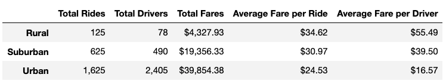
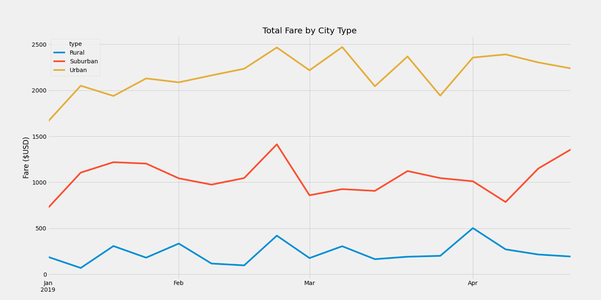

# PyBer_Analysis

## Overview of the analysis: 
PyBer is a python-based ride share app company.   The company has an ultimate goal of improving access and affordability to underserviced communities.  PyBer has asked the team to look closer at the data collected from January 2019 to May 2019.  The team needs to provide insight into the relationship between drivers, riders, fare costs and city type.

## Results: 

I used Jupyter Notebook for the python script and the following dependencies: Matplotlib and pandas.  Two cvs files were provided for the analysis: “city_data.cvs” and “ride_data.cvs”.  Both cvs files are located in the “Resources” folder.  

Before we continue let’s discuss terms and how they are defined in this analysis.
1.	City types: Urban, Rural, and Suburban
2.	Total Drivers: Sum of drivers by each city type
3.	Total Rides: Sum of rides by each city type
4.	Total Fares: Sum of fares by each city type
5.	Average fare per ride: (Total Fares/ Total Rides) by each city type
6.	Average fare per driver: (Total Fares/ Total Drivers) by each city type

### Deliverable 1: A Summary DataFrame 

To create a summary dataframe from the cvs file, we had to combine the two cvs files. This was done through python by merging on city.  After merging the files into a single dataframe, we could start aggregating the data into a summary dataframe.  The .sum() and .count() methods were used to obtain the PyBer Summary dataframe found below. 

As we can see from the summary table, the average cost per fare really depended on the city type you were in.  The costs span from an average fare per ride of $24.53 (Urban city type) to a high of $34.62 (Rural city type). Few more noteworthy items is the total number of drivers and rides by city type.  We have few drivers and rides in rural city types than the urban areas.  It could be the rural areas are being underserved or the fares are long distances since it is more rural. One piece of information that would be helpful is the average distance of each ride. It might even provide insight to look at the Total Rides/Total Drivers by city type.

|City Type | Rides per Driver|
|---------:|----------------:|
|Rural | 1.60 |
|Suburban | 1.28 |
|Urban | 0.68 |

When we look at the data this way we can see opportunities are being missed in the Rural city types. 

### Deliverable 2: A Summary DataFrame 

When large amount of data is collected it can sometimes be easier to view this information visually.  The second deliverable of this challenge was to provide a multiple-line chart of total fares for each city type.  There are two main functions needed during the 2nd deliverable: pivot() and resample().  After creating a resamples dataframe, we can then create a line graph in order to visualize the data.  The line graph created uses a built-in style called “fivethirtyeight”.

## Summary: 

Based on the results of our analysis, we have three recommendations for addressing any disparities among the city types. 

First recommendation would be to focus additional drivers in rural areas.  It is important to understand if ride counts are lower due to availability or just the fact there are less people wanting to ride share.  The rides per driver ratio suggest PyBer can increase drivers in this city type.   

Second recommendation is to focus on opportunities in the suburban cities.  The ride costs are high compared to urban areas but the demand for rides is still good.  

Third recommendation is to run specials or reduced rates in lower months like January.  January had lower fare totals in all three city types. 

